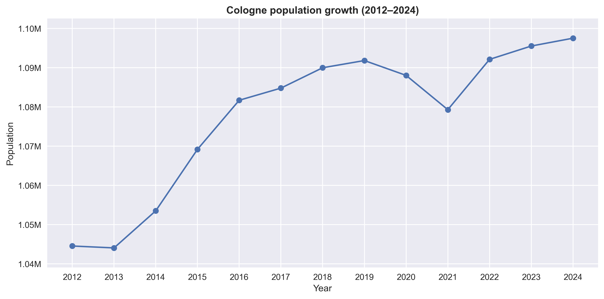
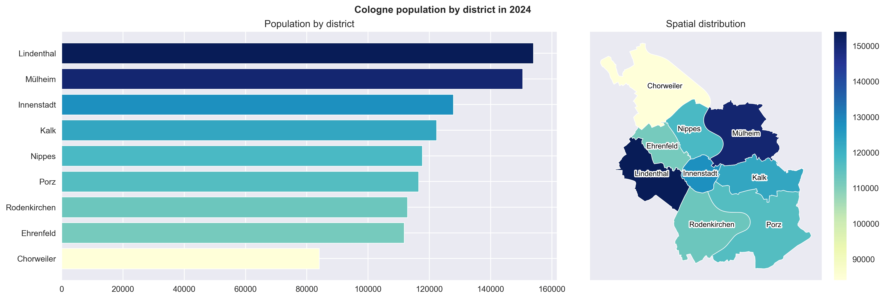
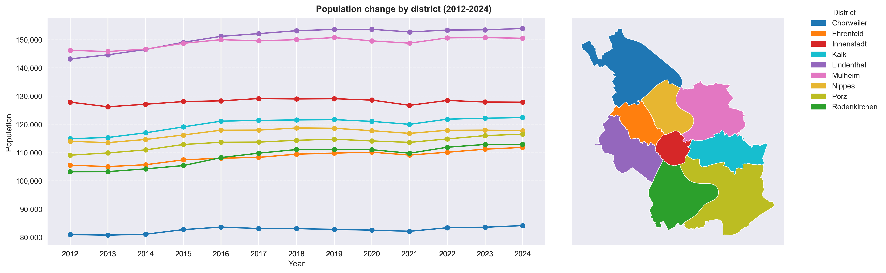
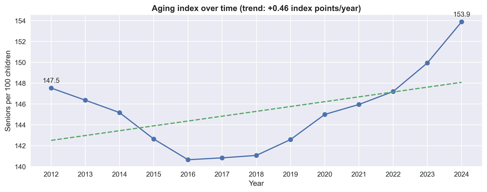
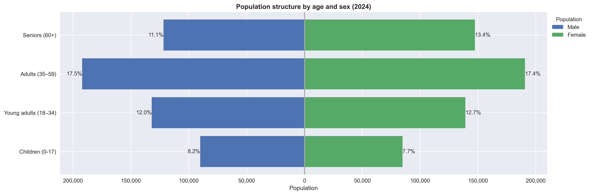
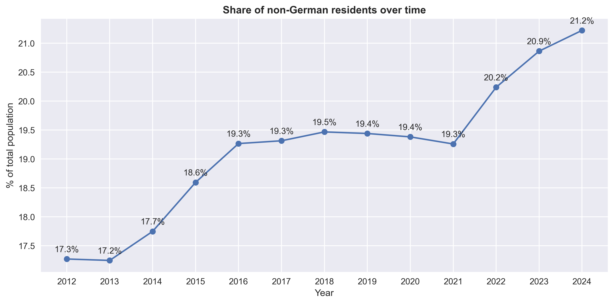
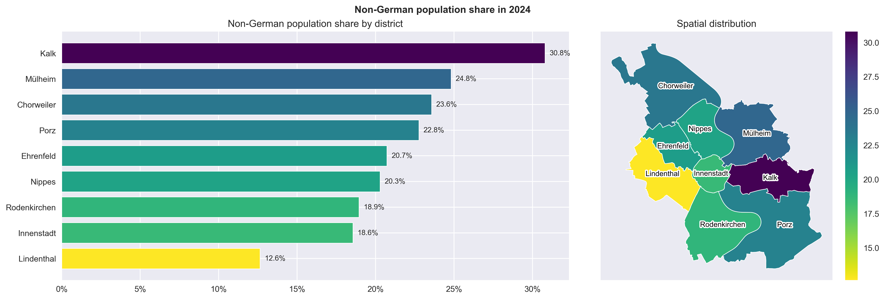

# Population and Demographic Analysis of Cologne

## Overview

This project analyzes the population structure of Cologne using official statistical data.

It focuses on identifying population trends, spatial differences, and demographic patterns across districts, providing insights into how the city evolves over time.

The analysis is designed to support urban planning, housing analysis, and socio-economic decision-making.

## Data

- **Time range:** 2012–2024
- **Granularity:**
  - City level
  - District level
- **Source:** [OFFENE DATEN KÖLN](https://offenedaten-koeln.de)

The dataset contains over 100 demographic, social, and economic indicators.
This analysis focuses on population-related variables and their distribution across districts.

Data is sourced from official open data portals and used in accordance with their licensing terms.

## Key Questions

1. How has Cologne’s population evolved over time?

2. How is the population distributed across districts?

3. What differences exist in demographic structure?

## Project Structure

```
data/
  raw/                          # original data
  processed/                    # cleaned and preprocessed datasets
  geo/                          # geospatial files

notebooks/
  01_data_preparation.ipynb
  02_EDA.ipynb

reports/
  figures/                      # exported visualizations

README.md
```

## Key Insights

### 1. Population Growth
*Steady population growth with a short-term pandemic disruption.*



Cologne’s population increased from approximately **1.04 million in 2012 to nearly 1.10 million in 2024**, showing steady growth over time.

Stronger growth in the mid-2010s may be linked to increased migration, which led to higher inflows into German cities. A **small decline in 2020-2021** is visible, likely due to COVID-19, which reduced mobility and migration.

**From 2022 onward, the population rises again**, supported by renewed migration and economic recovery.

Overall, this shows that Cologne is a **stable and attractive city**, with population growth that remains strong despite global disruptions.

### 2. Population Distribution Across Districts
*Population is unevenly distributed across districts.*



Population is not evenly distributed across Cologne.

Districts such as **Lindenthal** and **Mülheim** have significantly larger populations, while **Chorweiler** has a noticeably smaller population.

This pattern highlights structural differences in urban development and population density across the city.

The uneven distribution suggests **varying housing capacity, infrastructure availability, and service demand**, which are important factors for urban planning and resource allocation.

### 3. Growth Patterns by District
*Districts grow at different rates, indicating uneven development.*



All districts show overall population growth between 2012 and 2024, but at different rates.

Some districts experience stronger increases, while others remain relatively stable, highlighting uneven development across the city.

This suggests **local drivers of growth**, such as new housing development, migration patterns, and economic attractiveness, resulting in **uneven urban expansion across districts**.

### 4. Aging Index
*The population is aging over time.*



Cologne’s aging index shows an overall upward trend, indicating a growing share of older residents.

After a decline until around 2016, the index steadily increases, reaching its highest level in 2024.

This indicates a structural demographic shift toward an aging population, with implications for **healthcare, social services, and urban planning**.

### 5. Population Structure
*Working-age groups dominate the population structure.*



Cologne’s population is concentrated in the **working-age group (35–59)**, which represents the largest share for both men and women.

The **senior population (60+) is noticeably larger among women**, reflecting longer life expectancy.

The strong share of working-age population supports **economic activity and labor supply**, while the higher proportion of elderly women highlights **increasing demand for healthcare and social support services**.

### 6. Increasing share of Non-German Residents
*The share of non-German residents is steadily increasing over time.*



The share of non-German residents increased steadily from **17.3% in 2012 to over 21% in 2024**.

The increase becomes more pronounced after 2021, suggesting that recent population growth is partly driven by international migration.

Population growth is increasingly influenced by **international migration**, which may impact **labor markets, education systems, and integration policies**.

### 7. Non-German Population Share Across Districts
*Non-German population share varies significantly by district.*



The share of non-German residents varies significantly across districts.

- **Kalk** shows the highest share
- **Lindenthal** shows the lowest share

This pattern indicates **spatial clustering of demographic groups**, likely reflecting differences in **housing affordability, socio-economic structure, and local economic conditions** across districts.

## Technologies Used

Python, pandas, numpy, matplotlib, geopandas

## Data Sources

- **Statistical data (population, demographics):**  
  https://offenedaten-koeln.de/dataset/statistischer-datenkatalog-k%C3%B6ln  

- **Geospatial data (district boundaries):**  
  https://offenedaten-koeln.de/dataset/stadtteile-k%C3%B6ln  

_Data is provided under Data License Germany (dl-de/by-2-0 and dl-de/zero-2-0)._

## Next Steps

This project is *ongoing*. Planned extensions include:

- Socioeconomic analysis (Labour market, social benefits; households structure)

- Housing analysis (Housing stock, living space, subsidized housing)

- Mobility analysis (car ownership levels, gender & usage, electric vehicles)

- Extended exploring relationships between variables (correlation and clustering)

- Predictive or explanatory modeling